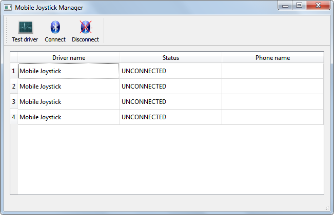

# Mobile Joystick

__Mobile Joystick__ is a set of software components which allow you to use your Android smartphone as a game controller. The input data consists of a position obtained from the phone's accelerometer and a state of buttons (up or down) represented by respective areas of the touch screen. 

The system is composed of three pieces:
* Virtual joystick driver for Windows 7+ implemented using the [KMDF](https://en.wikipedia.org/wiki/Kernel-Mode_Driver_Framework) framework.
* Android application.
* QT-based manager allowing the user to attach a selected phone to a virtual joystick and continuously update the state of the latter based on reports sent by the Android application over Bluetooth: .

> Note that the project may be a bit outdated as it was developed back in 2012 and tested using Android 2.3.x and Windows 7. However, even if some pieces of the code are no longer valid, it may still serve as a reference illustrating the general idea.

Main activity of the Android application:

Main window of the Mobile Joystick Manager:

